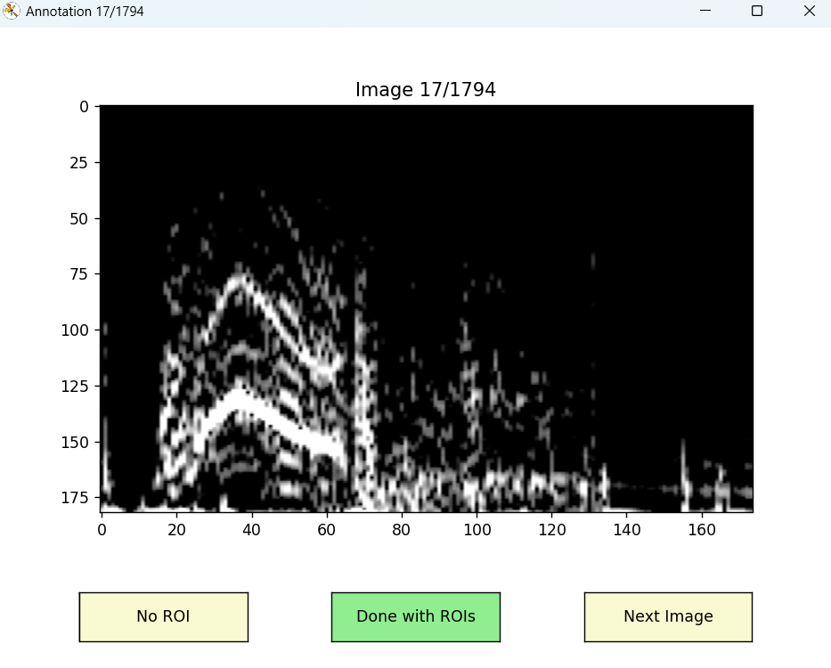
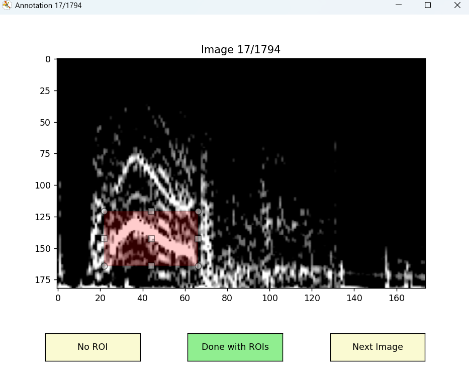

### Seizure Time-Frequency ROI Annotator

---

This Python package provides tools to annotate spectrogram images of seizure episodes.

📦 **PyPI**: [seizure-timefreqroi-annotator](https://pypi.org/project/seizure-timefreqroi-annotator/)

---

### 📑 Table of Contents
1. [Installation](#-installation)
2. [Annotation Interface Preview](#annotation-interface-preview)
3. [Image Annotation Process](#image-annotation-process)
   - [1. Draw the Bounding Box](#1-draw-the-bounding-box-if-theres-a-region-of-interest---roi)
   - [2. Click "Done"](#2-click-done)
   - [3. Move to the Next Image](#3-move-to-the-next-image)
   - [4. No ROI (If Applicable)](#4-no-roi-if-applicable)
   - [5. What Happens Next](#5-what-happens-next)
4. [Example of Annotations](#example-of-annotations)
5. [The Original Images Dataset](#-the-original-images-dataset-and-the-default-labels)
6. [Run Annotation GUI (Quick Start)](#️-run-annotation-gui-quick-start)
7. [Use Case: Fine-Tuning ViT for Automated ROI Detection](#use-case-fine-tuning-vit-for-automated-roi-detection-in-spectrograms)

---

### 📦 Installation

Install the package using pip:

```bash
pip install seizure-timefreqroi-annotator
```
---

### Annotation Interface Preview

<p>
  
  
</p>

> ### Image Annotation Process
> 
> Follow the steps below to annotate images in the tool:
> 
> #### 1. **Draw the Bounding Box (If There’s a Region of Interest - ROI)**
> - If the image contains an area you want to annotate, use the annotation tool to **draw a bounding box** around the region of interest (ROI).
> - Ensure the bounding box accurately covers the entire area that requires marking.
> - The y-axis displays the frequency range from 1 to 60 Hz, and the x-axis shows the time range from 0 to 60 seconds (based on the default range of the spectrogram image dataset).
> 
> #### 2. **Click “Done”**
> - After drawing the bounding box around the ROI, click on the **"Done"** button to confirm the annotation.
> - This action saves your selection and prepares you to move to the next step.
> 
> #### 3. **Move to the Next Image**
> - Once your annotation is complete, click **“Next Image”** to proceed to the next image in the dataset.
> - You’ll repeat the annotation process for each image.
> 
> #### 4. **No ROI (If Applicable)**
> - If the image does not have any region of interest to annotate, select **"No ROI"** instead of drawing a bounding box.
> - This marks the image as requiring **no annotation**.
> 
> #### 5. **What Happens Next**
> - Every action you take—whether drawing a bounding box or selecting "No ROI"—will automatically generate a corresponding entry in the `annotations.xlsx` file.
> - This file will include the following data:
>   - **Image filename**
>   - **Coordinates of the bounding box** (if applicable)
>   - **Flag indicating whether there was an ROI** (TRUE/FALSE)


### Example of Annotations

| image_file                                                    | has_roi | start_time | end_time | start_freq | end_freq |
| ------------------------------------------------------------- | ------- | ---------- | -------- | ---------- | -------- |
| 18206036_106.4_ch1_augment1_spectrogram.png                   | FALSE   |            |          |            |          |
| 18206036_106.4_ch1_augment2_spectrogram.png                   | FALSE   |            |          |            |          |
| 18206036_106.4_ch1_augment3_spectrogram.png                   | TRUE    | 8.620689655 | 17.5862069 | 11.10497238 | 18.27624309 |
| 18206036_106.4_ch1_augment4_spectrogram.png                   | TRUE    | 8.620689655 | 18.96551724 | 10.12707182 | 19.25414365 |
| 18206036_106.4_ch1_augment5_spectrogram.png                   | TRUE    | 8.620689655 | 18.96551724 | 9.149171271 | 18.27624309 |

---

### 📂 The Original Images Dataset and the Default Labels
The original images dataset and the default labels are also available in the Seizure_TimeFreqROI_Annotator/assets directory.

---

### ▶️ Run Annotation GUI (Quick Start)
You can run the annotation tool directly from the command line using this one-liner (replace the paths with your local installed package path):

```python
python -c "from Seizure_TimeFreqROI_Annotator.datasets import SpectrogramDataset; from Seizure_TimeFreqROI_Annotator.annotator import collect_annotations; dataset = SpectrogramDataset(r'C:\Users\Nooshin\myenv\Lib\site-packages\Seizure_TimeFreqROI_Annotator\assets\sample_spectrograms'); print(f'Loaded {len(dataset.image_files)} images'); collect_annotations(dataset, r'C:\Users\Nooshin\myenv\Lib\site-packages\Seizure_TimeFreqROI_Annotator\assets\labels\annotations.xlsx'); print('Annotations saved')"
```

---
### ▶️ Run Annotation GUI (Quick Start)
You can run the annotation tool directly from the command line using this one-liner (replace the paths with your local installed package path):

```python
python -c "
from Seizure_TimeFreqROI_Annotator.datasets import SpectrogramDataset;
from Seizure_TimeFreqROI_Annotator.annotator import collect_annotations;
import os

# Define paths
spectrogram_dir = r'C:\Users\Nooshin\myenv\Lib\site-packages\Seizure_TimeFreqROI_Annotator\assets\sample_spectrograms'
output_file = r'C:\Users\Nooshin\myenv\Lib\site-packages\Seizure_TimeFreqROI_Annotator\assets\labels\annotations.xlsx'

# Load dataset and collect annotations
dataset = SpectrogramDataset(spectrogram_dir)
print(f'Successfully loaded {len(dataset.image_files)} spectrogram images')
collect_annotations(dataset, output_file)
print(f'Annotations saved to {os.path.basename(output_file)}')
"
```

---

### Use Case: Fine-Tuning ViT for Automated ROI Detection in Spectrograms

Labeled spectrogram images can be used to automate Region of Interest (ROI) detection through fine-tuning. The script UseCase/FineTuning_ViT_on_SpectrogramImages.py implements a Vision Transformer (ViT) model enhanced with Low-Rank Adaptation (LoRA) for this task. The model performs both classification and regression to identify and localize ROIs while generating attention maps and visualizations for interpretability.

```bash
UseCase/FineTuning_ViT_on_SpectrogramImages.py

---

